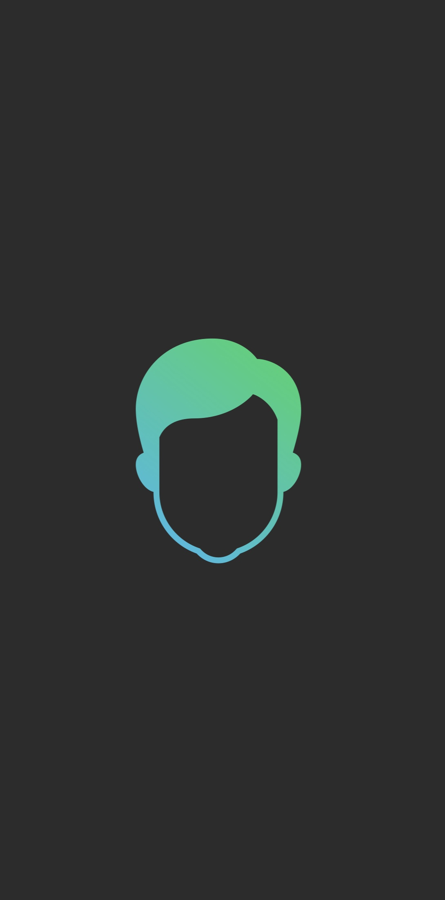

## About
[**Avatar Stickers**](https://apps.apple.com/us/app/avatar-stickers/id1574023061) - iOS application that allows you to create an animated stickers and export them to **Telegram** and **WhatsApp** messengers. The application was created while participating in the [contest](https://contest.com/sticker-app). Server code is available [here](https://github.com/starkdmi/AvatarStickersServer).

## Features
- [x] **Generate animated stickers**
- [x] **In-app stickers preview**
- [x] **Export to Telegram and WhatsApp**
- [x] **Sync sticker collections with iCloud**
- [x] **Share raw files (Lottie and TGS)**
- [x] **Available without network connection (Except the export)**

## Screenshots
|  Version  |  Gallery  | Recognition | Selection  |   Intro   | Settings  |   Launch   | 
| --- | --- | --- | --- | --- | --- | --- | 
| **1.0** |  |  |  | | | |
| **2.0** |  |  |  |  |  |  |
| **Video** |  |  |  |  | | |

## Stack 
- SwiftUI
- Combine
- Core Data
- Core ML
- Swift Package Manager
- Fastlane

## Build
Clone the project and open it in Xcode. Xcode will download Swift Packages automatically. You will need to provide an iCloud identifier in **TGStickersImport.entitlements** for Core Data cloud synchronization.

## Schemes
- **Debug** - Mocked animations and network requests (no server)
- **Local** - Requests in local network. Used in pair with local server
- **Release** - App Store 

## Xcode Previews
With power of SwiftUI the previews works as expected including mocked animations and Core Data.
<table align="center">
    <tr>
        <td align="center"></td>
        <td align="center"></td>
    </tr>
    <tr>
        <td align="center"></td>
        <td align="center"></td>
    </tr>
</table>

## Core ML
Most of the ML models were created using CreateML and public datasets. 10K images used per class which can also be improved.

## TODO
- [ ] Server API Key Security (using Configuration file)
- [ ] Export to different Telegram apps (non-official)
- [ ] Accessebility

## App Store
- Application main features was released during **Telegram contest from June 25 to July 4**. 
- The application was published in App Store in **August 2021** (after two weeks review). 
- In **Semptember** new updates were blocked due the **Guideline 4.3 - Design**
 
    >Same feature set as other apps submitted to the App Store
- In **January 2022** I've decided to **Open Source** it.

The application is still in App Store and available for **free** but will not receive any updates because of the App Store vague rules.

## Licenses
- [Lottie](https://github.com/airbnb/lottie-ios) - Apache 2.0
- [Fastlane](https://github.com/fastlane/fastlane) - MIT
- [SDWebImageSwiftUI](https://github.com/SDWebImage/SDWebImageSwiftUI) - MIT
- [GzipSwift](https://github.com/1024jp/GzipSwift) - MIT
- [TelegramStickersImport](https://github.com/TelegramMessenger/TelegramStickersImport) - MIT
- [WhatsApp Stickers](https://github.com/WhatsApp/stickers) - BSD
- [YPImagePicker](https://github.com/Yummypets/YPImagePicker) - MIT
- [ChameleonFramework](https://github.com/vicc/chameleon) - MIT
- [LicensePlist](https://github.com/mono0926/LicensePlist) - MIT
- [IconGenerator](https://github.com/onmyway133/IconGenerator) - MIT
